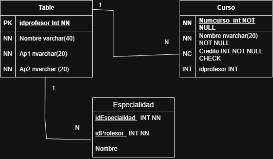

# Diccionario de Datos de la Universidad

## 1. Información General

| Elemento | Valor |
| :--- | :--- |
| Proyecto | Universidad |
| Versión | 1.0 |
| Fecha |03 Julio 2026 |
| Elaboró |Kevin Martinez  |
| SGBD | SQL Server |

---

## 2. Descripción del Sistema de Base de Datos

El sistema administra la información de los profesores y los cursos.

Permite almacenar:

- Profesores
- Cursos

Cada profesor puede impartir uno o varios cursos, mientras que cada curso es impartido por un solo profesor.

---

## 3. Catálogo de Restricciones Utilizadas

| Código | Significado |
| :--- | :--- |
| PK | Primary Key |
| FK | Foreign Key |
| NN | NOT NULL |
| UQ | UNIQUE |
| AI | Auto Increment |
| CK | Check |
| DF | Default |

---

## 4. Diccionario de Datos

## Tabla: Profesor

**Descripción**

Almacena la información de los profesores.

| Campo | Tipo | Longitud | Restricciones | Descripción |
|---------|---------|---------|---------|---------|
| id_profesor | INT | - | PK, AI, NN | Identificador único del profesor |
| clave_profesor | VARCHAR | 10 | UQ, NN | Clave del profesor |
| nombre | VARCHAR | 100 | NN | Nombre del profesor |
| especialidad | VARCHAR | 100 | NN | Especialidad del profesor |

---

## Tabla: Curso

**Descripción**

Almacena la información de los cursos.

| Campo | Tipo | Longitud | Restricciones | Descripción |
|---------|---------|---------|---------|---------|
| id_curso | INT | - | PK, AI, NN | Identificador único del curso |
| identificacion_curso | VARCHAR | 20 | UQ, NN | Identificación del curso |
| nombre_curso | VARCHAR | 100 | NN | Nombre del curso |
| creditos | INT | - | NN | Créditos del curso |
| id_profesor | INT | - | FK, NN | Profesor que imparte el curso |

---

## 5. Relaciones en la Base de Datos

| Relación | Cardinalidad | Descripción |
| :--- | :--- | :--- |
| Profesor → Curso | 1:N | Un profesor puede impartir varios cursos y cada curso pertenece a un solo profesor. |

---

## 6. Matriz de Claves Foráneas

| Tabla | Campo FK | Referencia |
| :--- | :--- | :--- |
| Curso | id_profesor | Profesor(id_profesor) |

---

## 7. Integridad Referencial

| Código | Regla |
| :--- | :--- |
| IR-01 | No se puede registrar un curso para un profesor inexistente. |
| IR-02 | No se puede eliminar un profesor que tenga cursos asignados sin reasignarlos previamente. |
| IR-03 | Todo curso debe estar asignado a un profesor. |

---

## 8. Reglas de Negocio

| Código | Regla |
| :--- | :--- |
| RN-01 | Un profesor puede impartir varios cursos. |
| RN-02 | Un curso solamente puede ser impartido por un profesor. |
| RN-03 | Puede existir un profesor que actualmente no imparta cursos. |
| RN-04 | Todo curso debe ser asignado a un profesor. |

---

## 9. Diagrama Relacional

