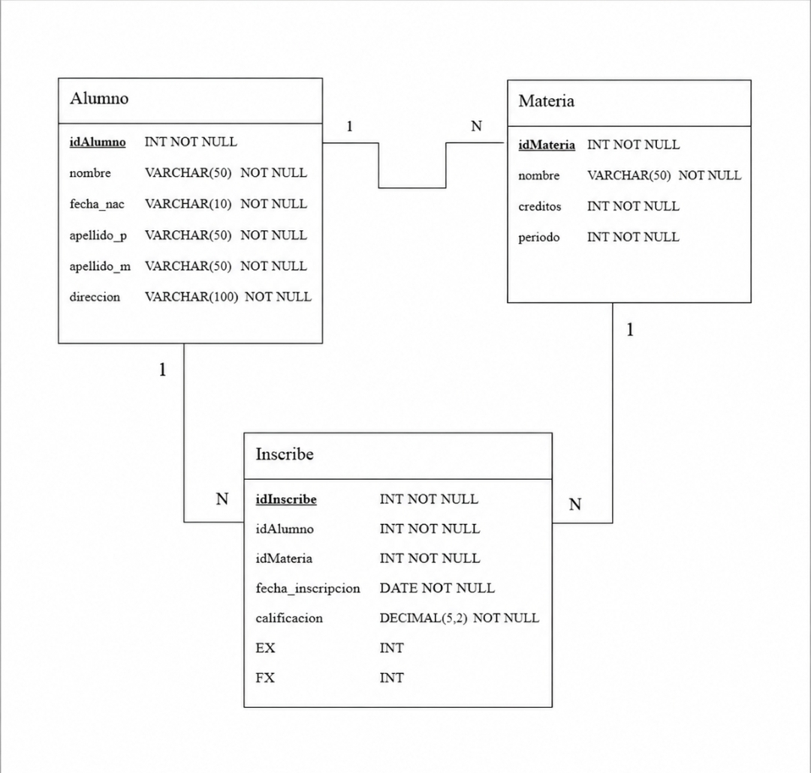

# Diccionario de Datos de la Base de Datos de la Escuela

## 1. Información General

| Elemento | Valor |
| :--- | :--- |
| Proyecto | Escuela |
| Versión | 1.0 |
| Fecha | 03 de Julio 2026 |
| Elaboró | Kevin Martinez |
| SGBD | SQL Server |

---

## 2. Descripción del Sistema de Base de Datos

El sistema administra la información de los alumnos, las materias y las inscripciones.

Permite almacenar:

- Alumnos
- Materias
- Inscripciones

Cada alumno puede inscribirse en una o varias materias y cada materia puede tener inscritos a varios alumnos.

---

## 3. Catálogo de Restricciones Utilizadas

| Código | Significado |
| :--- | :--- |
| PK | Primary Key |
| FK | Foreign Key |
| NN | NOT NULL |
| UQ | UNIQUE |
| AI | Auto Increment |
| CK | Check |
| DF | Default |

---

## 4. Diccionario de Datos

## Tabla: Alumno

**Descripción**

Almacena la información de los alumnos.

| Campo | Tipo | Longitud | Restricciones | Descripción |
|---------|---------|---------|---------|---------|
| id_alumno | INT | - | PK, AI, NN | Identificador único del alumno |
| matricula | VARCHAR | 15 | UQ, NN | Matrícula del alumno |
| nombre | VARCHAR | 100 | NN | Nombre del alumno |
| semestre | INT | - | NN | Semestre que cursa el alumno |

---

## Tabla: Materia

**Descripción**

Almacena la información de las materias.

| Campo | Tipo | Longitud | Restricciones | Descripción |
|---------|---------|---------|---------|---------|
| id_materia | INT | - | PK, AI, NN | Identificador único de la materia |
| clave_materia | VARCHAR | 20 | UQ, NN | Clave de la materia |
| nombre_materia | VARCHAR | 100 | NN | Nombre de la materia |
| creditos | INT | - | NN | Créditos de la materia |

---

## Tabla: Inscripción

**Descripción**

Almacena la relación entre alumnos y materias.

| Campo | Tipo | Longitud | Restricciones | Descripción |
|---------|---------|---------|---------|---------|
| id_inscripcion | INT | - | PK, AI, NN | Identificador de la inscripción |
| fecha_inscripcion | DATE | - | NN | Fecha de inscripción |
| calificacion_final | DECIMAL | 4,2 | NN | Calificación final obtenida |
| id_alumno | INT | - | FK, NN | Alumno inscrito |
| id_materia | INT | - | FK, NN | Materia inscrita |

---

## 5. Relaciones en la Base de Datos

| Relación | Cardinalidad | Descripción |
| :--- | :--- | :--- |
| Alumno → Inscripción | 1:N | Un alumno puede tener varias inscripciones. |
| Materia → Inscripción | 1:N | Una materia puede tener varias inscripciones. |

---

## 6. Matriz de Claves Foráneas

| Tabla | Campo FK | Referencia |
| :--- | :--- | :--- |
| Inscripción | id_alumno | Alumno(id_alumno) |
| Inscripción | id_materia | Materia(id_materia) |

---

## 7. Integridad Referencial

| Código | Regla |
| :--- | :--- |
| IR-01 | No se puede registrar una inscripción para un alumno inexistente. |
| IR-02 | No se puede registrar una inscripción para una materia inexistente. |
| IR-03 | No se puede eliminar un alumno que tenga inscripciones registradas sin eliminarlas previamente. |
| IR-04 | No se puede eliminar una materia que tenga alumnos inscritos sin eliminar las inscripciones correspondientes. |

---

## 8. Reglas de Negocio

| Código | Regla |
| :--- | :--- |
| RN-01 | Un alumno puede inscribirse en varias materias. |
| RN-02 | Una materia puede tener muchos alumnos inscritos. |
| RN-03 | Puede existir una materia sin alumnos inscritos. |
| RN-04 | Todo alumno debe estar inscrito en al menos una materia. |
| RN-05 | De cada inscripción se registra la fecha de inscripción. |
| RN-06 | De cada inscripción se registra la calificación final. |

---

## 9. Diagrama Relacional

