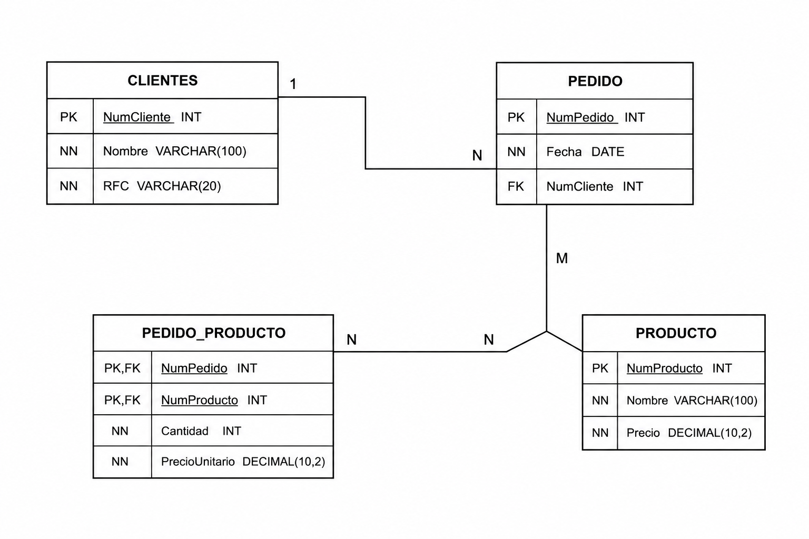

# Diccionario de Datos de la Base de Datos de los clientes

## 1. Información General

| Elemento | Valor |
| :--- | :--- |
| Proyecto | Empresa de Venta de Productos |
| Versión | 1.0 |
| Fecha | 03 Julio 2026 |
| Elaboró | Kevin Martinez |
| SGBD | SQL Server |

---

## 2. Descripción del Sistema de Base de Datos

El sistema administra la información de los clientes, pedidos, productos y el detalle de cada pedido.

Permite almacenar:

- Clientes
- Pedidos
- Productos
- Detalle de Pedido

Cada cliente puede realizar varios pedidos. Cada pedido puede contener uno o varios productos, registrando la cantidad y el precio de venta de cada producto.

---

## 3. Catálogo de Restricciones Utilizadas

| Código | Significado |
| :--- | :--- |
| PK | Primary Key |
| FK | Foreign Key |
| NN | NOT NULL |
| UQ | UNIQUE |
| AI | Auto Increment |
| CK | Check |
| DF | Default |

---

## 4. Diccionario de Datos

## Tabla: Cliente

**Descripción**

Almacena la información de los clientes.

| Campo | Tipo | Longitud | Restricciones | Descripción |
|---------|---------|---------|---------|---------|
| id_cliente | INT | - | PK, AI, NN | Identificador único del cliente |
| numero_cliente | VARCHAR | 20 | UQ, NN | Número de cliente |
| nombre_cliente | VARCHAR | 100 | NN | Nombre del cliente |
| rfc | VARCHAR | 13 | UQ, NN | RFC del cliente |

---

## Tabla: Pedido

**Descripción**

Almacena la información de los pedidos realizados por los clientes.

| Campo | Tipo | Longitud | Restricciones | Descripción |
|---------|---------|---------|---------|---------|
| id_pedido | INT | - | PK, AI, NN | Identificador único del pedido |
| numero_pedido | VARCHAR | 20 | UQ, NN | Número del pedido |
| fecha | DATE | - | NN | Fecha del pedido |
| id_cliente | INT | - | FK, NN | Cliente que realizó el pedido |

---

## Tabla: Producto

**Descripción**

Almacena la información de los productos.

| Campo | Tipo | Longitud | Restricciones | Descripción |
|---------|---------|---------|---------|---------|
| id_producto | INT | - | PK, AI, NN | Identificador único del producto |
| numero_producto | VARCHAR | 20 | UQ, NN | Número del producto |
| nombre | VARCHAR | 100 | NN | Nombre del producto |
| precio | DECIMAL | 10,2 | NN | Precio del producto |

---

## Tabla: Detalle_Pedido

**Descripción**

Almacena los productos que contiene cada pedido.

| Campo | Tipo | Longitud | Restricciones | Descripción |
|---------|---------|---------|---------|---------|
| id_detalle | INT | - | PK, AI, NN | Identificador del detalle del pedido |
| cantidad | INT | - | NN | Cantidad del producto solicitado |
| precio_venta | DECIMAL | 10,2 | NN | Precio de venta del producto |
| id_pedido | INT | - | FK, NN | Pedido al que pertenece el detalle |
| id_producto | INT | - | FK, NN | Producto incluido en el pedido |

---

## 5. Relaciones en la Base de Datos

| Relación | Cardinalidad | Descripción |
| :--- | :--- | :--- |
| Cliente → Pedido | 1:N | Un cliente puede realizar muchos pedidos. |
| Pedido → Detalle_Pedido | 1:N | Un pedido puede contener varios productos mediante el detalle del pedido. |
| Producto → Detalle_Pedido | 1:N | Un producto puede aparecer en muchos pedidos mediante el detalle del pedido. |

---

## 6. Matriz de Claves Foráneas

| Tabla | Campo FK | Referencia |
| :--- | :--- | :--- |
| Pedido | id_cliente | Cliente(id_cliente) |
| Detalle_Pedido | id_pedido | Pedido(id_pedido) |
| Detalle_Pedido | id_producto | Producto(id_producto) |

---

## 7. Integridad Referencial

| Código | Regla |
| :--- | :--- |
| IR-01 | No se puede registrar un pedido para un cliente inexistente. |
| IR-02 | No se puede registrar un detalle para un pedido inexistente. |
| IR-03 | No se puede registrar un detalle para un producto inexistente. |
| IR-04 | No se puede eliminar un pedido que tenga detalles registrados sin eliminarlos previamente. |
| IR-05 | No se puede eliminar un producto que esté registrado en un detalle de pedido. |

---

## 8. Reglas de Negocio

| Código | Regla |
| :--- | :--- |
| RN-01 | Un cliente puede realizar muchos pedidos. |
| RN-02 | Cada pedido pertenece a un solo cliente. |
| RN-03 | Un pedido puede contener varios productos. |
| RN-04 | Un producto puede aparecer en muchos pedidos. |
| RN-05 | Un pedido debe contener al menos un producto. |
| RN-06 | Un producto puede no haber sido vendido. |
| RN-07 | El detalle de pedido no existe sin un pedido. |
| RN-08 | El detalle de pedido no existe sin un producto. |
| RN-09 | El detalle de pedido almacena la cantidad y el precio de venta de cada producto. |

---

## 9. Diagrama Relacional

