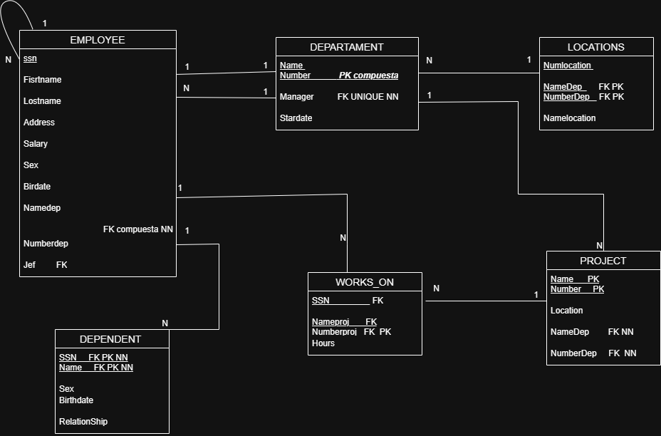
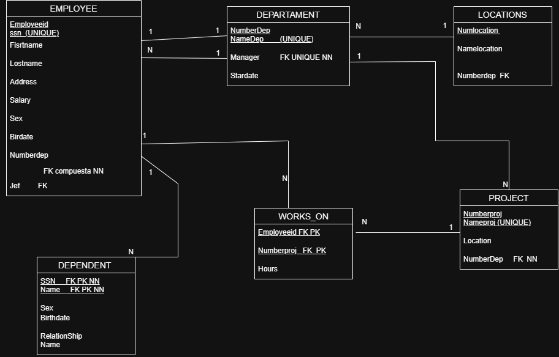

# Diccionario de Datos de la Base de Datos de la Empresa

## 1. Información General

| Elemento | Valor |
| :--- | :--- |
| Proyecto | Empresa |
| Versión | 1.0 |
| Fecha | 03 de Julio 2026 |
| Elaboró | Kevin Martinez|
| SGBD | SQL Server |

---

## 2. Descripción del Sistema de Base de Datos

El sistema administra la información de los departamentos, empleados, proyectos y dependientes de una empresa.

Permite almacenar:

- Departamentos
- Empleados
- Proyectos
- Dependientes
- Ubicaciones de los departamentos
- Asignaciones de empleados a proyectos

Cada departamento es administrado por un empleado, controla uno o varios proyectos y cuenta con una o varias ubicaciones. Los empleados pertenecen a un departamento, pueden trabajar en varios proyectos y tener dependientes registrados.

---

## 3. Catálogo de Restricciones Utilizadas

| Código | Significado |
| :--- | :--- |
| PK | Primary Key |
| FK | Foreign Key |
| NN | NOT NULL |
| UQ | UNIQUE |
| AI | Auto Increment |
| CK | Check |
| DF | Default |

---

## 4. Diccionario de Datos

## Tabla: Departamento

**Descripción**

Almacena la información de los departamentos.

| Campo | Tipo | Longitud | Restricciones | Descripción |
|---------|---------|---------|---------|---------|
| id_departamento | INT | - | PK, AI, NN | Identificador único del departamento |
| numero_departamento | INT | - | UQ, NN | Número del departamento |
| nombre_departamento | VARCHAR | 100 | UQ, NN | Nombre del departamento |
| fecha_inicio_gerente | DATE | - | NN | Fecha en que el gerente inició funciones |
| id_gerente | INT | - | FK, UQ, NN | Empleado que administra el departamento |

---

## Tabla: Ubicacion_Departamento

**Descripción**

Almacena las ubicaciones de cada departamento.

| Campo | Tipo | Longitud | Restricciones | Descripción |
|---------|---------|---------|---------|---------|
| id_ubicacion | INT | - | PK, AI, NN | Identificador de la ubicación |
| ubicacion | VARCHAR | 100 | NN | Ubicación del departamento |
| id_departamento | INT | - | FK, NN | Departamento al que pertenece |

---

## Tabla: Empleado

**Descripción**

Almacena la información de los empleados.

| Campo | Tipo | Longitud | Restricciones | Descripción |
|---------|---------|---------|---------|---------|
| id_empleado | INT | - | PK, AI, NN | Identificador del empleado |
| ssn | VARCHAR | 15 | UQ, NN | Número de Seguro Social |
| nombre | VARCHAR | 100 | NN | Nombre del empleado |
| direccion | VARCHAR | 150 | NN | Dirección |
| salario | DECIMAL | 10,2 | NN | Salario |
| sexo | CHAR | 1 | NN | Sexo |
| fecha_nacimiento | DATE | - | NN | Fecha de nacimiento |
| id_departamento | INT | - | FK, NN | Departamento al que pertenece |
| id_supervisor | INT | - | FK | Supervisor del empleado |

---

## Tabla: Proyecto

**Descripción**

Almacena la información de los proyectos.

| Campo | Tipo | Longitud | Restricciones | Descripción |
|---------|---------|---------|---------|---------|
| id_proyecto | INT | - | PK, AI, NN | Identificador del proyecto |
| numero_proyecto | INT | - | UQ, NN | Número del proyecto |
| nombre_proyecto | VARCHAR | 100 | UQ, NN | Nombre del proyecto |
| ubicacion | VARCHAR | 100 | NN | Ubicación del proyecto |
| id_departamento | INT | - | FK, NN | Departamento que controla el proyecto |

---

## Tabla: Trabaja_En

**Descripción**

Almacena la asignación de empleados a proyectos.

| Campo | Tipo | Longitud | Restricciones | Descripción |
|---------|---------|---------|---------|---------|
| id_trabaja | INT | - | PK, AI, NN | Identificador de la asignación |
| horas_semana | DECIMAL | 5,2 | NN | Horas trabajadas por semana |
| id_empleado | INT | - | FK, NN | Empleado asignado |
| id_proyecto | INT | - | FK, NN | Proyecto asignado |

---

## Tabla: Dependiente

**Descripción**

Almacena la información de los dependientes.

| Campo | Tipo | Longitud | Restricciones | Descripción |
|---------|---------|---------|---------|---------|
| id_dependiente | INT | - | PK, AI, NN | Identificador del dependiente |
| nombre | VARCHAR | 100 | NN | Nombre del dependiente |
| sexo | CHAR | 1 | NN | Sexo |
| fecha_nacimiento | DATE | - | NN | Fecha de nacimiento |
| parentesco | VARCHAR | 50 | NN | Parentesco con el empleado |
| id_empleado | INT | - | FK, NN | Empleado al que pertenece |

---

## 5. Relaciones en la Base de Datos

| Relación | Cardinalidad | Descripción |
| :--- | :--- | :--- |
| Departamento → Empleado | 1:N | Un departamento tiene varios empleados. |
| Empleado → Departamento (Gerente) | 1:1 | Un empleado administra como máximo un departamento. |
| Departamento → Proyecto | 1:N | Un departamento controla varios proyectos. |
| Departamento → Ubicación_Departamento | 1:N | Un departamento puede tener una o varias ubicaciones. |
| Empleado → Trabaja_En | 1:N | Un empleado puede trabajar en varios proyectos. |
| Proyecto → Trabaja_En | 1:N | Un proyecto puede tener varios empleados. |
| Empleado → Dependiente | 1:N | Un empleado puede tener varios dependientes. |
| Empleado → Empleado | 1:N | Un supervisor puede supervisar varios empleados. |

---

## 6. Matriz de Claves Foráneas

| Tabla | Campo FK | Referencia |
| :--- | :--- | :--- |
| Departamento | id_gerente | Empleado(id_empleado) |
| Ubicacion_Departamento | id_departamento | Departamento(id_departamento) |
| Empleado | id_departamento | Departamento(id_departamento) |
| Empleado | id_supervisor | Empleado(id_empleado) |
| Proyecto | id_departamento | Departamento(id_departamento) |
| Trabaja_En | id_empleado | Empleado(id_empleado) |
| Trabaja_En | id_proyecto | Proyecto(id_proyecto) |
| Dependiente | id_empleado | Empleado(id_empleado) |

---

## 7. Integridad Referencial

| Código | Regla |
| :--- | :--- |
| IR-01 | No se puede registrar un empleado en un departamento inexistente. |
| IR-02 | No se puede registrar un proyecto para un departamento inexistente. |
| IR-03 | No se puede asignar un empleado a un proyecto inexistente. |
| IR-04 | No se puede registrar un dependiente para un empleado inexistente. |
| IR-05 | No se puede registrar una ubicación para un departamento inexistente. |
| IR-06 | No se puede asignar un gerente inexistente a un departamento. |

---

## 8. Reglas de Negocio

| Código | Regla |
| :--- | :--- |
| RN-01 | Cada departamento tiene un nombre y un número únicos. |
| RN-02 | Cada departamento es administrado por un solo empleado. |
| RN-03 | Un empleado puede administrar como máximo un departamento. |
| RN-04 | Un departamento puede tener una o varias ubicaciones. |
| RN-05 | Un departamento controla uno o varios proyectos. |
| RN-06 | Cada proyecto pertenece a un solo departamento. |
| RN-07 | Todo empleado pertenece a un único departamento. |
| RN-08 | Un empleado puede trabajar en varios proyectos. |
| RN-09 | Un proyecto puede tener varios empleados trabajando en él. |
| RN-10 | De cada asignación se almacenan las horas trabajadas por semana. |
| RN-11 | Cada empleado tiene un supervisor directo. |
| RN-12 | Un supervisor puede supervisar a varios empleados. |
| RN-13 | Un empleado puede tener cero o varios dependientes. |
| RN-14 | Cada dependiente pertenece a un solo empleado. |

---

## 9. Diagrama Relacional

