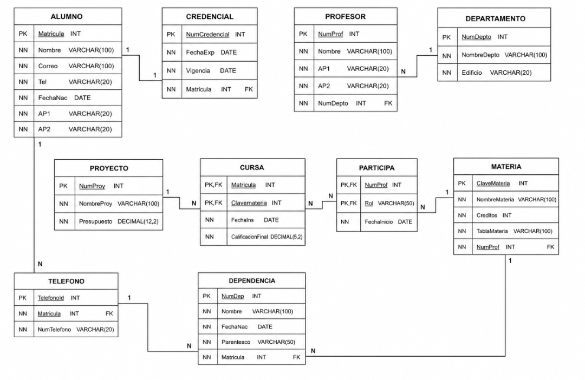

# Diccionario de Datos de la Base de Datos de la Universidad

## 1. Información General

| Elemento | Valor |
| :--- | :--- |
| Proyecto | Universidad |
| Versión | 1.0 |
| Fecha | Julio 2026 |
| Elaboró | Kevin Martinez |
| SGBD | SQL Server |

---

## 2. Descripción del Sistema de Base de Datos

El sistema administra la información de los alumnos, credenciales, teléfonos, profesores, departamentos, materias, proyectos, dependencias y las relaciones entre ellos.

Permite almacenar:

- Alumnos
- Credenciales
- Teléfonos
- Profesores
- Departamentos
- Materias
- Proyectos
- Dependencias
- Inscripciones
- Participaciones

El sistema controla la inscripción de alumnos a materias, la participación de profesores en proyectos y la organización académica de la universidad.

---

## 3. Catálogo de Restricciones Utilizadas

| Código | Significado |
| :--- | :--- |
| PK | Primary Key |
| FK | Foreign Key |
| NN | NOT NULL |
| UQ | UNIQUE |
| AI | Auto Increment |
| CK | Check |
| DF | Default |

---

# 4. Diccionario de Datos

## Tabla: Alumno

**Descripción**

Almacena la información de los alumnos.

| Campo | Tipo | Longitud | Restricciones | Descripción |
|---------|---------|---------|---------|---------|
| matricula | INT | - | PK, NN | Matrícula del alumno |
| nombre | VARCHAR | 100 | NN | Nombre del alumno |
| correo | VARCHAR | 100 | NN | Correo electrónico |
| tel | VARCHAR | 20 | NN | Teléfono |
| fecha_nac | DATE | - | NN | Fecha de nacimiento |
| ap1 | VARCHAR | 20 | NN | Primer apellido |
| ap2 | VARCHAR | 20 | NN | Segundo apellido |

---

## Tabla: Credencial

**Descripción**

Almacena la información de las credenciales de los alumnos.

| Campo | Tipo | Longitud | Restricciones | Descripción |
|---------|---------|---------|---------|---------|
| num_credencial | INT | - | PK, NN | Número de credencial |
| fecha_exp | DATE | - | NN | Fecha de expedición |
| vigencia | DATE | - | NN | Vigencia de la credencial |
| matricula | INT | - | FK, NN | Alumno propietario |

---

## Tabla: Telefono

**Descripción**

Almacena los teléfonos registrados por los alumnos.

| Campo | Tipo | Longitud | Restricciones | Descripción |
|---------|---------|---------|---------|---------|
| telefono_id | INT | - | PK, NN | Identificador del teléfono |
| matricula | INT | - | FK, NN | Alumno propietario |
| num_telefono | VARCHAR | 20 | NN | Número telefónico |

---

## Tabla: Profesor

**Descripción**

Almacena la información de los profesores.

| Campo | Tipo | Longitud | Restricciones | Descripción |
|---------|---------|---------|---------|---------|
| num_prof | INT | - | PK, NN | Identificador del profesor |
| nombre | VARCHAR | 100 | NN | Nombre |
| ap1 | VARCHAR | 20 | NN | Primer apellido |
| ap2 | VARCHAR | 20 | NN | Segundo apellido |
| num_depto | INT | - | FK, NN | Departamento al que pertenece |

---

## Tabla: Departamento

**Descripción**

Almacena la información de los departamentos.

| Campo | Tipo | Longitud | Restricciones | Descripción |
|---------|---------|---------|---------|---------|
| num_depto | INT | - | PK, NN | Número del departamento |
| nombre_depto | VARCHAR | 100 | NN | Nombre del departamento |
| edificio | VARCHAR | 20 | NN | Edificio |

---

## Tabla: Materia

**Descripción**

Almacena la información de las materias.

| Campo | Tipo | Longitud | Restricciones | Descripción |
|---------|---------|---------|---------|---------|
| clave_materia | INT | - | PK, NN | Clave de la materia |
| nombre_materia | VARCHAR | 100 | NN | Nombre de la materia |
| creditos | INT | - | NN | Créditos |
| tabla_materia | VARCHAR | 100 | NN | Tabla de la materia |
| num_prof | INT | - | FK, NN | Profesor que imparte |

---

## Tabla: Proyecto

**Descripción**

Almacena la información de los proyectos.

| Campo | Tipo | Longitud | Restricciones | Descripción |
|---------|---------|---------|---------|---------|
| num_proy | INT | - | PK, NN | Número del proyecto |
| nombre_proy | VARCHAR | 100 | NN | Nombre del proyecto |
| presupuesto | DECIMAL | 12,2 | NN | Presupuesto |

---

## Tabla: Cursa

**Descripción**

Almacena la inscripción de alumnos en materias.

| Campo | Tipo | Longitud | Restricciones | Descripción |
|---------|---------|---------|---------|---------|
| matricula | INT | - | PK, FK | Alumno inscrito |
| clave_materia | INT | - | PK, FK | Materia inscrita |
| fecha_ins | DATE | - | NN | Fecha de inscripción |
| calificacion_final | DECIMAL | 5,2 | NN | Calificación final |

---

## Tabla: Participa

**Descripción**

Almacena la participación de profesores en proyectos.

| Campo | Tipo | Longitud | Restricciones | Descripción |
|---------|---------|---------|---------|---------|
| num_prof | INT | - | PK, FK | Profesor participante |
| num_proy | INT | - | PK, FK | Proyecto |
| rol | VARCHAR | 50 | NN | Rol desempeñado |
| fecha_inicio | DATE | - | NN | Fecha de inicio |

---

## Tabla: Dependencia

**Descripción**

Almacena la información de los dependientes de los profesores.

| Campo | Tipo | Longitud | Restricciones | Descripción |
|---------|---------|---------|---------|---------|
| num_dep | INT | - | PK, NN | Identificador del dependiente |
| nombre | VARCHAR | 100 | NN | Nombre |
| fecha_nac | DATE | - | NN | Fecha de nacimiento |
| parentesco | VARCHAR | 50 | NN | Parentesco |
| num_prof | INT | - | FK, NN | Profesor al que pertenece |

---

## 5. Relaciones en la Base de Datos

| Relación | Cardinalidad | Descripción |
| :--- | :--- | :--- |
| Alumno → Credencial | 1:1 | Cada alumno posee una credencial. |
| Alumno → Teléfono | 1:N | Un alumno puede registrar varios teléfonos. |
| Alumno → Cursa | 1:N | Un alumno puede cursar varias materias. |
| Materia → Cursa | 1:N | Una materia puede ser cursada por varios alumnos. |
| Profesor → Materia | 1:N | Un profesor puede impartir varias materias. |
| Departamento → Profesor | 1:N | Un departamento tiene varios profesores. |
| Profesor → Participa | 1:N | Un profesor participa en varios proyectos. |
| Proyecto → Participa | 1:N | Un proyecto puede tener varios profesores. |
| Profesor → Dependencia | 1:N | Un profesor puede tener varios dependientes. |

---

## 6. Matriz de Claves Foráneas

| Tabla | Campo FK | Referencia |
| :--- | :--- | :--- |
| Credencial | matricula | Alumno(matricula) |
| Telefono | matricula | Alumno(matricula) |
| Profesor | num_depto | Departamento(num_depto) |
| Materia | num_prof | Profesor(num_prof) |
| Cursa | matricula | Alumno(matricula) |
| Cursa | clave_materia | Materia(clave_materia) |
| Participa | num_prof | Profesor(num_prof) |
| Participa | num_proy | Proyecto(num_proy) |
| Dependencia | num_prof | Profesor(num_prof) |

---

## 7. Integridad Referencial

| Código | Regla |
| :--- | :--- |
| IR-01 | No se puede registrar una credencial para un alumno inexistente. |
| IR-02 | No se puede registrar un teléfono para un alumno inexistente. |
| IR-03 | No se puede asignar una materia a un profesor inexistente. |
| IR-04 | No se puede registrar una inscripción sin alumno o materia. |
| IR-05 | No se puede registrar una participación sin profesor o proyecto. |
| IR-06 | No se puede registrar un dependiente para un profesor inexistente. |

---

## 8. Reglas de Negocio

| Código | Regla |
| :--- | :--- |
| RN-01 | Cada alumno posee una sola credencial. |
| RN-02 | Un alumno puede registrar varios teléfonos. |
| RN-03 | Un alumno puede cursar varias materias. |
| RN-04 | Una materia puede tener varios alumnos inscritos. |
| RN-05 | Un profesor puede impartir varias materias. |
| RN-06 | Un profesor pertenece a un solo departamento. |
| RN-07 | Un profesor puede participar en varios proyectos. |
| RN-08 | Un proyecto puede tener varios profesores participantes. |
| RN-09 | Un profesor puede registrar varios dependientes. |

---

## 9. Diagrama Relacional

