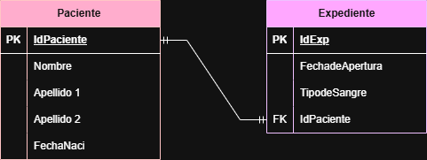
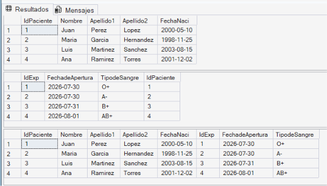
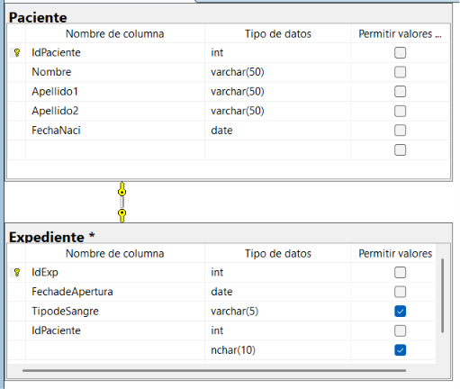

# Base de Datos Hospital

## Diagrama Entidad-Relación


## Script SQL

```sql
CREATE DATABASE Hospital;
GO

USE Hospital;
GO

CREATE TABLE Paciente(
    IdPaciente INT IDENTITY(1,1) PRIMARY KEY,
    Nombre VARCHAR(50) NOT NULL,
    Apellido1 VARCHAR(50) NOT NULL,
    Apellido2 VARCHAR(50) NOT NULL,
    FechaNaci DATE NOT NULL
);

CREATE TABLE Expediente(
    IdExp INT IDENTITY(1,1) PRIMARY KEY,
    FechadeApertura DATE NOT NULL,
    TipodeSangre VARCHAR(5) NOT NULL,
    IdPaciente INT NOT NULL UNIQUE,
    CONSTRAINT FK_Expediente_Paciente
    FOREIGN KEY (IdPaciente)
    REFERENCES Paciente(IdPaciente)
);
```

## Consulta

```sql
SELECT *
FROM Paciente P
INNER JOIN Expediente E
ON P.IdPaciente = E.IdPaciente;
```
## Resultado tablas

## Diagrama en SQL
