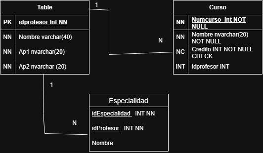
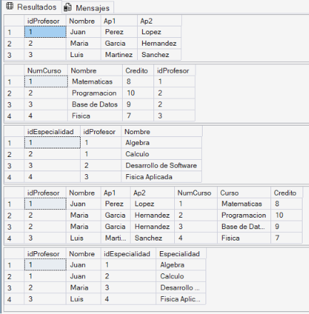
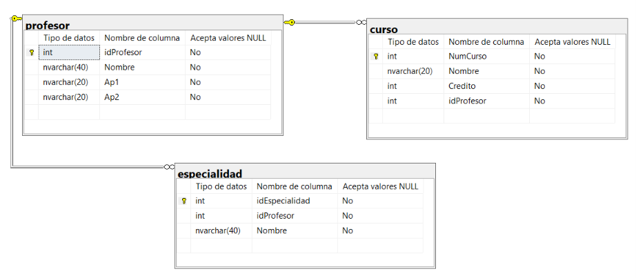

# Base de Datos Escuela
 - Kevin Matinez Gonzaga

## Diagrama Entidad-Relación


## Script SQL

```sql
CREATE DATABASE Escuela;
GO

USE Escuela;
GO

CREATE TABLE Profesor(
    idProfesor INT IDENTITY(1,1) PRIMARY KEY,
    Nombre NVARCHAR(40) NOT NULL,
    Ap1 NVARCHAR(20) NOT NULL,
    Ap2 NVARCHAR(20) NOT NULL
);

CREATE TABLE Curso(
    NumCurso INT IDENTITY(1,1) PRIMARY KEY,
    Nombre NVARCHAR(20) NOT NULL,
    Credito INT NOT NULL CHECK(Credito > 0),
    idProfesor INT NOT NULL,
    CONSTRAINT FK_Curso_Profesor
    FOREIGN KEY(idProfesor)
    REFERENCES Profesor(idProfesor)
);

CREATE TABLE Especialidad(
    idEspecialidad INT IDENTITY(1,1) PRIMARY KEY,
    Nombre NVARCHAR(40) NOT NULL,
    idProfesor INT NOT NULL,
    CONSTRAINT FK_Especialidad_Profesor
    FOREIGN KEY(idProfesor)
    REFERENCES Profesor(idProfesor)
);
```

## Consulta

```sql
SELECT *
FROM Profesor P
INNER JOIN Curso C
ON P.idProfesor = C.idProfesor;

SELECT *
FROM Profesor P
INNER JOIN Especialidad E
ON P.idProfesor = E.idProfesor;
```
## Tablas sql 


## Diagrama sql 
