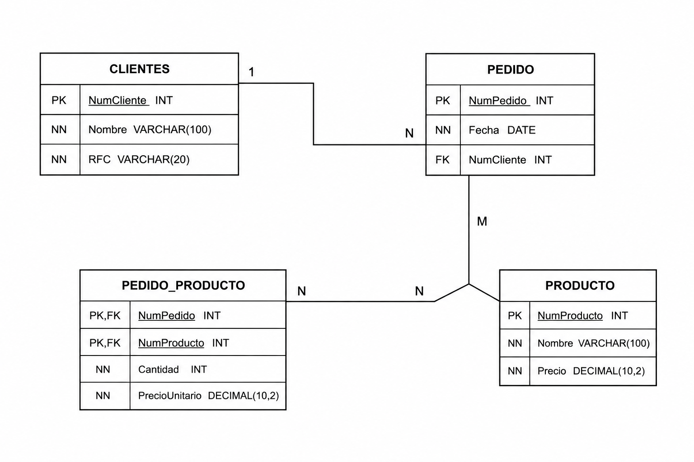
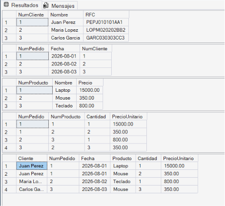
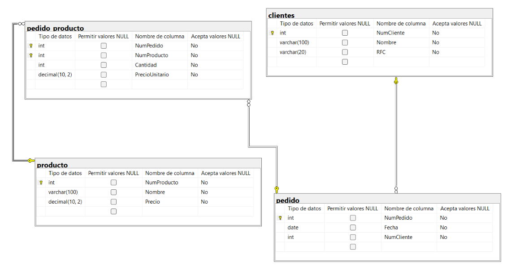

# Base de Datos Ventas

## Diagrama Entidad-Relación


## Script SQL

```sql
CREATE DATABASE Ventas;
GO

USE Ventas;
GO

CREATE TABLE Clientes(
    NumCliente INT IDENTITY(1,1) PRIMARY KEY,
    Nombre VARCHAR(100) NOT NULL,
    RFC VARCHAR(20) NOT NULL
);

CREATE TABLE Pedido(
    NumPedido INT IDENTITY(1,1) PRIMARY KEY,
    Fecha DATE NOT NULL,
    NumCliente INT NOT NULL,
    CONSTRAINT FK_Pedido_Cliente
    FOREIGN KEY(NumCliente)
    REFERENCES Clientes(NumCliente)
);

CREATE TABLE Producto(
    NumProducto INT IDENTITY(1,1) PRIMARY KEY,
    Nombre VARCHAR(100) NOT NULL,
    Precio DECIMAL(10,2) NOT NULL
);

CREATE TABLE Pedido_Producto(
    NumPedido INT NOT NULL,
    NumProducto INT NOT NULL,
    Cantidad INT NOT NULL,
    PrecioUnitario DECIMAL(10,2) NOT NULL,

    CONSTRAINT PK_Pedido_Producto
    PRIMARY KEY(NumPedido,NumProducto),

    CONSTRAINT FK_PP_Pedido
    FOREIGN KEY(NumPedido)
    REFERENCES Pedido(NumPedido),

    CONSTRAINT FK_PP_Producto
    FOREIGN KEY(NumProducto)
    REFERENCES Producto(NumProducto)
);
```

## Consulta

```sql
SELECT *
FROM Clientes C
INNER JOIN Pedido P
ON C.NumCliente = P.NumCliente;

SELECT *
FROM Pedido P
INNER JOIN Pedido_Producto PP
ON P.NumPedido = PP.NumPedido;

SELECT *
FROM Producto PR
INNER JOIN Pedido_Producto PP
ON PR.NumProducto = PP.NumProducto;
```
## tablas 

## diagrama 

