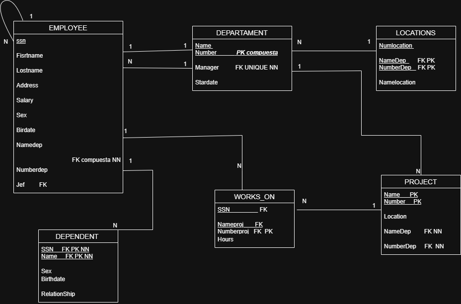
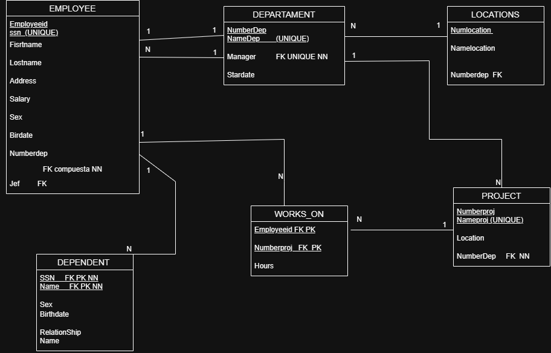
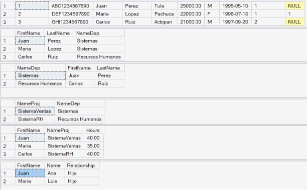
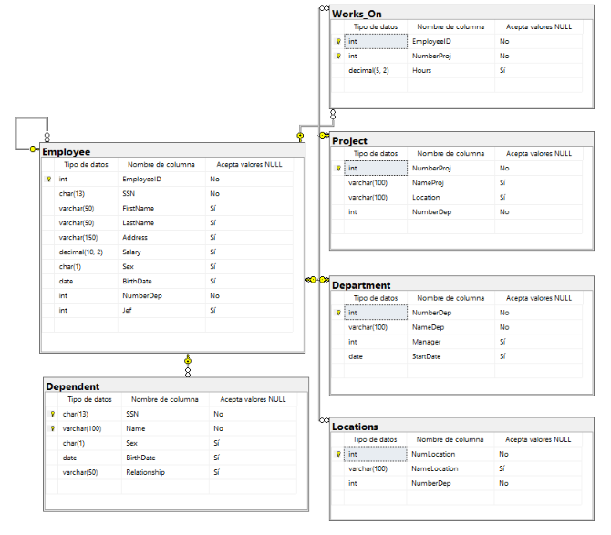

# Base de Datos Company
- Maria Fernanda Hernandez Santillan

## Diagrama Entidad-Relación



## Script SQL

```sql
CREATE DATABASE Company;
GO

USE Company;
GO

CREATE TABLE Department(
    NumberDep INT PRIMARY KEY,
    NameDep VARCHAR(100) UNIQUE NOT NULL,
    Manager INT,
    StartDate DATE
);

CREATE TABLE Employee(
    EmployeeID INT PRIMARY KEY,
    SSN CHAR(13) UNIQUE NOT NULL,
    FirstName VARCHAR(50),
    LastName VARCHAR(50),
    Address VARCHAR(150),
    Salary DECIMAL(10,2),
    Sex CHAR(1),
    BirthDate DATE,
    NumberDep INT NOT NULL,
    Jef INT,
    FOREIGN KEY(NumberDep)
    REFERENCES Department(NumberDep),
    FOREIGN KEY(Jef)
    REFERENCES Employee(EmployeeID)
);

ALTER TABLE Department
ADD CONSTRAINT FK_Department_Manager
FOREIGN KEY(Manager)
REFERENCES Employee(EmployeeID);

CREATE TABLE Locations(
    NumLocation INT PRIMARY KEY,
    NameLocation VARCHAR(100),
    NumberDep INT NOT NULL,
    FOREIGN KEY(NumberDep)
    REFERENCES Department(NumberDep)
);

CREATE TABLE Project(
    NumberProj INT PRIMARY KEY,
    NameProj VARCHAR(100) UNIQUE,
    Location VARCHAR(100),
    NumberDep INT NOT NULL,
    FOREIGN KEY(NumberDep)
    REFERENCES Department(NumberDep)
);

CREATE TABLE Dependent(
    SSN CHAR(13),
    Name VARCHAR(100),
    Sex CHAR(1),
    BirthDate DATE,
    Relationship VARCHAR(50),
    PRIMARY KEY(SSN,Name),
    FOREIGN KEY(SSN)
    REFERENCES Employee(SSN)
);

CREATE TABLE Works_On(
    EmployeeID INT,
    NumberProj INT,
    Hours DECIMAL(5,2),
    PRIMARY KEY(EmployeeID,NumberProj),
    FOREIGN KEY(EmployeeID)
    REFERENCES Employee(EmployeeID),
    FOREIGN KEY(NumberProj)
    REFERENCES Project(NumberProj)
);
```

## Consulta

```sql
SELECT *
FROM Employee E
INNER JOIN Department D
ON E.NumberDep = D.NumberDep;

SELECT *
FROM Department D
INNER JOIN Locations L
ON D.NumberDep = L.NumberDep;

SELECT *
FROM Department D
INNER JOIN Project P
ON D.NumberDep = P.NumberDep;

SELECT *
FROM Employee E
INNER JOIN Works_On W
ON E.EmployeeID = W.EmployeeID
INNER JOIN Project P
ON W.NumberProj = P.NumberProj;

SELECT *
FROM Employee E
INNER JOIN Dependent D
ON E.SSN = D.SSN;
```
## tablas 

## diagrama sql 
